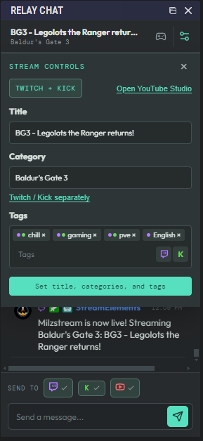
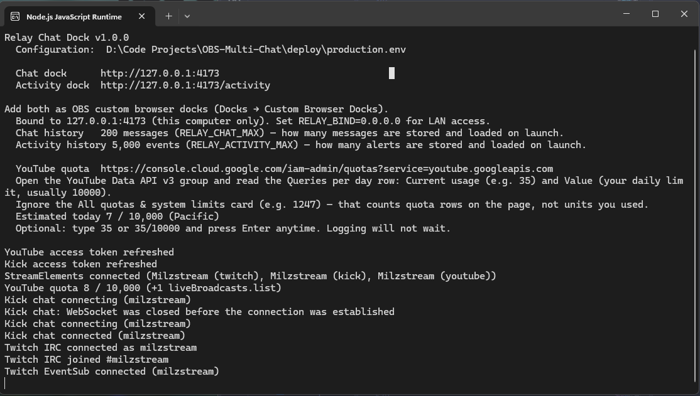

# Relay Chat Dock

A local OBS companion that combines Twitch, Kick, and YouTube live chat into one dock, plus a second Activity dock for follows, subs, gifts, cheers, raids, Super Chats, memberships, merch, and StreamElements donations.






## Download

The latest Windows build is on the [Releases](https://github.com/Milzstream/OBS-Multi-Chat/releases) page.

**Installer (recommended)**

1. Download `obs-multi-chat-v*-windows-x64-setup.exe` and run it
2. Leave **Add Relay Chat and Relay Activity as OBS custom browser docks** checked unless those docks already exist. After OBS starts, open **Docks** and check **Relay Chat** and **Relay Activity** — OBS lists installer-added docks but leaves them hidden until you enable them
3. Optional: walk through Twitch, Kick, YouTube, and StreamElements (each page can open that provider). Skip and edit the env file later if you prefer
4. The finish page shows `%LOCALAPPDATA%\Relay Chat Dock\production.env` — the console prints that path on every launch
5. Start **Relay Chat Dock** from the Start Menu

The app itself installs under Program Files. `production.env` and `data\` stay in `%LOCALAPPDATA%\Relay Chat Dock` so updates do not require writing next to the exe. On launch, missing keys from `.env.example` are appended to `production.env` without changing your existing values. Installed copies can prompt to download the next setup exe, run it, and reopen.

**Portable zip**

1. Download `obs-multi-chat-v*-windows-x64.zip`
2. Unzip it and fill in `production.env`
3. Keep `package.json` and `.env.example` beside `relay-chat-dock.exe`
4. Run `relay-chat-dock.exe` and add the two dock URLs in OBS if you did not use the installer

GitHub Actions attaches both the zip and the setup exe when `main` first ships a given `package.json` version, when you push a `v*` tag, or when you run **Build and Release** from the Actions tab.

## What is included

- Responsive OBS chat dock with platform filters and compact mode
- OAuth callback server for Twitch, Kick, and YouTube
- Server-side token persistence in the local `data/tokens.json` file (beside the executable when packaged)
- Chat history persistence in `data/chat.json` (the most recent `RELAY_CHAT_MAX` messages, 5000 by default) so a backend restart does not empty the dock
- Activity history persistence in `data/activity.json` (the most recent `RELAY_ACTIVITY_MAX` events, 5000 by default)
- Twitch live detection, viewer count, EventSub/IRC chat, message sending, and title/category updates
- YouTube live detection, viewer count, live-chat reading, and Live vs Shorts tags when the Shorts title includes `#shortsfeed`
- Kick chat over Kick's public chat WebSocket
- SSE updates from the backend to OBS
- Unified Twitch + Kick stream title/category/tag controls, with arrow-key category picking and an Open YouTube Studio link

- Activity dock (StreamElements as source of truth, optional native backup)
- Windows background executable packaging

## OBS docks

The console prints both URLs on launch:

```text
http://localhost:4173
http://localhost:4173/activity
```

Add both as **Docks → Custom Browser Docks**, or let the installer register them and then check **Relay Chat** and **Relay Activity** under **Docks**. Chat is for messages and sending. Activity is the alert feed.

Stream Controls (gamepad on the chat dock) sets one title, one category search, and one tag list for Twitch + Kick. Category search queries both platforms and merges matching names; platform-only hits show a Twitch or Kick icon. **Twitch / Kick separately** expands to two category fields when the games differ. Tags share one chip field (max 10). Toggle Twitch / Kick next to the field before adding a chip. Dots on each chip show who gets it. **Open YouTube Studio** (next to the Twitch + Kick badge) opens the livestreaming dashboard for scheduling. Click a platform tile to open that platform's live dashboard (Twitch Stream Manager, Kick stream dashboard, or YouTube Studio). The stream title always opens the YouTube Studio livestreaming dashboard, which lists every live screen.

## API setup

You need to create an API application for each platform. Use this callback URL in every provider dashboard:

```text
http://localhost:4173/oauth/callback
```

### Twitch

1. Visit https://dev.twitch.tv/console/apps.
2. Create a new application.
3. Set the OAuth redirect URL to the callback URL above.
4. Set the client type to **Confidential/Private**, copy the client ID, and generate a client secret.

The app requests email, IRC chat, EventSub chat read/write, broadcast metadata, moderation (so platform-reported bans and unbans update the dock), follower, subscription, and bits permissions. After updating the app, disconnect and reconnect Twitch so the new chat and alert scopes can be granted. The client secret stays in the backend environment file and is never sent to OBS.

### Automatic chat translation

Messages containing CJK, Cyrillic, Arabic, Hangul, or Hebrew text can be translated to English for the dock. The original message stays visible with an **EN** marker. Translation is on by default; turn it off with **Translate non-English chat to English** in Connection Settings.

By default the translated text comes from Google's unofficial `translate.googleapis.com` endpoint (`client=gtx`), which needs no key. If you would rather not use the unofficial endpoint, set one of these in `production.env` and restart:

- `TRANSLATE_API_KEY` — uses Google Cloud Translation (the official API).
- `TRANSLATE_URL` — uses a LibreTranslate-compatible endpoint, with optional `TRANSLATE_API_KEY` for the service's key.

If translation fails, Connection Settings shows why and messages stay in the original language. Translation is an outbound third-party request, so turn the setting off if that is not acceptable for your stream.

### Google / YouTube

1. Visit https://console.cloud.google.com/.
2. Create or select a Google Cloud project.
3. Enable **YouTube Data API v3**.
4. Configure the OAuth consent screen.
5. Create an OAuth client as a **Web application**.
6. Add the callback URL above as an authorized redirect URI.
7. Copy the client ID and client secret.

The app requests YouTube read access and the live-chat scope needed to send and moderate chat. Google’s consent screen describes that scope as permission to delete videos. This app never deletes, edits, or uploads videos.

YouTube Data API v3 defaults to **10,000 units per day** (reset at midnight Pacific). This project is built to stay under that free-tier cap for a normal stream day, without requesting a quota increase. Higher limits exist only if Google approved a quota increase for that Cloud project — it is not a paid YouTube plan.

The console prints a link to the [Cloud Console quotas page](https://console.cloud.google.com/iam-admin/quotas?service=youtube.googleapis.com). To enter your current usage, open the **YouTube Data API v3** group and read the **Queries per day** row: **Current usage** (for example `35`) and **Value** (the daily limit, usually `10,000`). Ignore the **All quotas & system limits** card near the top of the page (for example `1,247`) — that is a count of how many quota rows exist, not units you have used. Optionally type `35` or `35/10000` and press Enter at any time; logging does not block on your input. After that, the app estimates forward from its own official API calls and warns near 80% and when the daily cap is reached. InnerTube site chat does not count against the quota.

Live chat and viewer counts use YouTube’s public site/InnerTube reader, not a polling loop on `liveChatMessages.list`. The official API is used sparingly: live-broadcast detection on a slow interval (about 3 minutes while offline, much less often while live), a one-shot history seed when a new live chat appears, sending and deleting messages, and a slow official chat fallback only if InnerTube fails. **Check live** in connection settings runs that official status check immediately without changing the automatic interval. If the daily quota is exhausted, official calls pause until midnight Pacific and InnerTube chat continues.

If you run two **separate** live broadcasts at the same time — a normal 16:9 stream and a vertical Shorts stream — put `#shortsfeed` in the title of the vertical/Shorts broadcast only. The dock then labels that chat **Shorts** and the other chat **Live**, without spending extra API calls to guess which is which. If only one live broadcast is up, the labels stay hidden. If your single scheduled livestream already feeds both 16:9 and vertical viewers at once, this tag is not needed and may not be honored.

We do not use `search.list` (historically expensive). YouTube subscribers are StreamElements-only. A backend restart reloads `data/chat.json` and skips another YouTube history API call when that live chat is already on disk.

Twitch and Kick end when OBS stops sending RTMP. A scheduled YouTube live stays up until you end it in Studio. When you create or edit that schedule in YouTube Studio, turn on **end the stream when the signal stops** (or the equivalent “auto-stop” option). This companion does not end YouTube broadcasts.

### Kick

1. Create an application in the Kick developer portal: https://dev.kick.com/.
2. Set the OAuth redirect URL to the callback URL above.
3. Copy the client ID and client secret.
4. Confirm that your account has access to the current Kick chat and channel API endpoints. The app requests `channel:write` so it can update stream metadata.

Kick API access can vary by developer account and API version, so the backend accepts `KICK_API_BASE` for the current public API base URL. It defaults to `https://api.kick.com/public/v1`. Incoming Kick chat uses Kick's public Pusher WebSocket; sending still uses the official chat API.

## Configure the backend

Create the environment file from the included template. For the packaged Windows executable, name it `production.env` and place it beside the `.exe`:

```powershell
copy .env.example production.env
notepad production.env
```

Fill in the values:

```env
PORT=4173
OAUTH_REDIRECT_URI=http://localhost:4173/oauth/callback
# RELAY_BIND=127.0.0.1
# RELAY_API_TOKEN=
# RELAY_DATA_DIR=

TWITCH_CLIENT_ID=your_twitch_client_id
TWITCH_CLIENT_SECRET=your_twitch_client_secret

KICK_CLIENT_ID=your_kick_client_id
KICK_CLIENT_SECRET=your_kick_client_secret
# KICK_API_BASE=
# Optional if Edge/Chrome is installed in a non-standard location:
# Shared by the Kick chatroom-ID lookup and the YouTube InnerTube fallback:
# BROWSER_PATH=C:\\Path\\To\\msedge.exe
# (KICK_BROWSER_PATH still works as a deprecated alias for it)

YOUTUBE_CLIENT_ID=your_google_client_id
YOUTUBE_CLIENT_SECRET=your_google_client_secret

# StreamElements JWTs — one per linked platform
# Dashboard → avatar → switch to that platform → Show secrets
STREAMELEMENTS_JWT_TWITCH=
STREAMELEMENTS_JWT_KICK=
STREAMELEMENTS_JWT_YOUTUBE=
```

The backend binds to `127.0.0.1` by default so only this computer can reach the control API. Set `RELAY_BIND=0.0.0.0` only if another device on your LAN must open the docks, and set `RELAY_API_TOKEN` so non-browser LAN clients must send that secret. Packaged runs store `data/` beside the executable; `RELAY_DATA_DIR` overrides the location.

Never commit or share `.env` or `production.env`. Client secrets, JWTs, access tokens, and refresh tokens must remain on the backend and must not be placed in `VITE_` variables or the OBS Browser Source.

## Run with Node

```powershell
npm install
npm run build
npm start
```

The backend serves the docks at `http://localhost:4173` and `http://localhost:4173/activity`. Keep `npm start` running while OBS is open. For frontend development, use `npm run dev` and run `npm run dev:backend` in a second terminal.

Click **Connect** for each platform in either dock's settings. Each button opens a browser authorization window. After authorization, the callback stores the token and the backend begins polling or connecting to the platform.

### Moderation

Right-click a chat row to delete that message, or timeout/ban the chatter on that platform. A ban or timeout strikes through every message from that chatter in the Relay chat (the same strikethrough Kick and YouTube show). Right-click a struck-through row and choose **Unban / untimeout** to undo it and restore the messages. A delete reported by Twitch, Kick, or YouTube strikes through just that one message. If Twitch, Kick, or YouTube report a ban, timeout, unban, or delete themselves, the same line-out/restore runs automatically. YouTube unban from Relay only works for bans and timeouts that were issued from this dock, because YouTube's API needs that ban id.

### Activity dock

StreamElements is the source of truth. Paste one JWT per linked platform in Activity dock **Connection Settings** (or in `production.env`). Copy each while switched to that channel in the SE dashboard (avatar → Show secrets). JWTs last weeks, not hours. Saving a JWT in settings reconnects StreamElements without restarting the companion.

If a JWT is missing, the console and Activity dock warn you. Use **Ignore missing StreamElements JWT alerts** if you only use some platforms. Dismissing the banner with × hides it for the current session only; a page refresh brings it back unless ignore is checked.

| Filter | What you see |
| --- | --- |
| Twitch / Kick / YouTube | Follows, subs, gifts, cheers, raids, Super Chats, memberships from that platform |
| SE | Donations, merch, and other non-platform StreamElements events |
| All | Everything |

The funnel next to the flask filters by kind (Follow, Sub/gift, Cheer/raid, Donation/merch, Super Chat/membership) without a second toolbar. Combine it with the platform icons. All kinds are on by default.

Newest alerts stay at the top; older rows drop down. Each row shows the platform logo first, then the event type. Click a row to open that user's profile in your default browser (not inside the OBS dock). Both docks paint only the on-screen rows.

**Drop alerts older than 30 days** is off by default so quieter streams keep a long history. Turn it on to automatically remove events older than 30 days.

**Use connected accounts as backup for StreamElements** is on by default. Turn it off if you do not want native Twitch/Kick/YouTube events as a fallback. Duplicate events within 15 seconds are ignored either way.

Hiding or skipping an event in the StreamElements dashboard does **not** remove it here. SE does not publish a hide/delete activity event over the websocket we use.

Activity test rows from `/api/activity/test` are in-memory only and are not saved to disk.

Activity history is stored locally in `data/activity.json` (last 5000 real events by default, or 30 days if that setting is on). Chat history is stored locally in `data/chat.json`. Think of `data/chat.json` as a crash buffer: it lets a backend restart (or OBS refresh) reload the last messages so the dock never comes back empty mid-stream. It is not a full archive or a VOD: messages that arrived while the backend was down are never backfilled. The chat buffer holds the last 5000 messages by default; set `RELAY_CHAT_MAX` in `production.env` to a value from 100 to 1,000,000 to keep more or fewer. Activity uses the same range via `RELAY_ACTIVITY_MAX`. The number is the trade-off: memory and the size of `chat.json` / `activity.json` both scale with it, so a high-volume stream might set 50,000 while a small one can lower it. Installer copies keep `production.env` and `data\` under `%LOCALAPPDATA%\Relay Chat Dock`. Portable zips keep those files beside the exe. Development runs keep them under the project directory. `RELAY_DATA_DIR` overrides any of those. Token, settings, chat, and activity files are written atomically with a `.bak` fallback so a crash during save does not wipe credentials or history. Restarting the backend reloads both files, so the docks are not empty. Past messages from while the backend was down do not appear: Twitch and Kick have no cheap replay, and YouTube liveChat history is skipped when this live chat is already on disk so a restart does not spend extra quota filling the gap.

### Testing alerts

1. Open the Activity dock and click the flask icon. That injects a local test row through `/api/activity/test`. It proves the dock and filters without hitting platform APIs, and it is not persisted.
2. With JWTs in `production.env`, replay an event from the SE dashboard activity feed. Overlay **Emulate** usually only hits the overlay iframe, not this dock.
3. Native backup (if the settings checkbox is on): reconnect Twitch so follow/sub/bits EventSub is granted, then follow from an alt. Kick follows/subs appear on the public chat socket. YouTube Super Chats/memberships appear in live chat. YouTube subscribers are SE-only.

## Run as a Windows background app

Prefer the [prebuilt Windows installer](https://github.com/Milzstream/OBS-Multi-Chat/releases) unless you are changing the code. To build the executable locally:

```powershell
npm run package:win
npm run installer:win
```

`package:win` creates `deploy\relay-chat-dock.exe`. `installer:win` needs [Inno Setup 6](https://jrsoftware.org/isinfo.php) and writes `obs-multi-chat-v*-windows-x64-setup.exe`. For a portable run, keep `production.env` and `.env.example` beside the executable, then run:

```powershell
.\relay-chat-dock.exe
```

The same command also creates a ready-to-copy `deploy` folder containing the latest executable and frontend `dist` files. Existing values in `deploy/production.env` (including StreamElements JWTs) are preserved; the packager only adds missing keys. Copy that entire folder to the installation computer and run `deploy\relay-chat-dock.exe`.

On launch the exe appends any keys that are in `.env.example` but missing from `production.env`, including commented optional lines such as `# RELAY_ACTIVITY_MAX=5000`. Filled values and keys you already commented stay as they are. Installer updates replace `.env.example` next to the exe; `production.env` in `%LOCALAPPDATA%\Relay Chat Dock` is left alone.

The executable serves the docks at `http://localhost:4173` and binds to loopback (`127.0.0.1`) by default so other devices on the network cannot call send, moderate, disconnect, or `/api/open`. Tokens, settings, chat, and activity stay in a `data` folder beside the `.exe`. Start it before opening OBS.

## Backend endpoints

- `GET /api/state` - current accounts, stream info, recent messages, activity, and settings
- `GET /events` - Server-Sent Events stream for dock updates
- `POST /api/messages` - send a message to selected platforms
- `POST /api/settings` - toggle native backup, ignore-missing-JWT, and 30-day drop
- `POST /api/open` - open an allowlisted Twitch, Kick, or YouTube profile URL, or YouTube Studio, in the system default browser
- `POST /api/activity/test` - inject a local test activity row (not persisted)
- `GET /api/categories/:platform` - search Twitch or Kick categories
- `POST /api/stream-info/:platform` - apply title/category/tags to one platform
- `POST /api/stream-info` - apply shared title plus per-platform Twitch/Kick category and tags
- `POST /api/disconnect/:platform` - remove a saved platform connection
- `POST /api/live-check/:platform` - run that platform's live check immediately (does not change the slower automatic YouTube interval)
- `GET /oauth/:platform` - begin OAuth for `twitch`, `kick`, or `youtube`
- `GET /oauth/callback` - exchange the provider authorization code server-side

## Current platform status

Twitch reads chat through EventSub WebSockets and sends through the Helix chat API, with Twitch IRC as a fallback for older tokens. YouTube OAuth and live detection use the Data API; incoming chat and viewer counts prefer InnerTube so a stream day fits in the default 10,000-unit quota. Kick OAuth, category search, chat sending, viewer polling, and metadata updates use the current public API. Incoming Kick chat is read from Kick's public chat WebSocket after resolving the channel's chatroom id. Activity alerts prefer StreamElements JWTs, with optional native backup from those same connections.

## License

This project is source-available under the MIT License with the [Commons Clause](https://commonsclause.com/). See [LICENSE](LICENSE) for the full terms.

You may use, copy, modify, and share this software for free, including on your own stream even if that stream is monetized.

You may not sell this software, charge for copies of it, or offer it as a paid product or hosted service.
