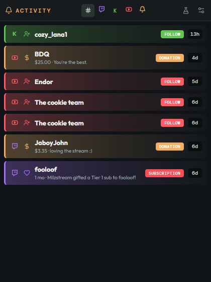

# Relay Chat Dock

A local OBS companion that combines Twitch, Kick, and YouTube live chat into one dock, plus a second Activity dock for follows, subs, gifts, cheers, raids, Super Chats, memberships, merch, and StreamElements donations.




## Download

The latest Windows build is on the [Releases](https://github.com/Milzstream/OBS-Multi-Chat/releases) page.

1. Download `obs-multi-chat-v*-windows-x64.zip`
2. Unzip it and fill in `production.env` with your API credentials and StreamElements JWTs
3. Run `relay-chat-dock.exe` and copy the two dock URLs printed at the top of the console
4. In OBS, add custom browser docks for chat and activity

GitHub Actions builds that zip and attaches it to the GitHub Release when `main` first ships a given `package.json` version, when you push a `v*` tag, or when you run **Build and Release** from the Actions tab.

## What is included

- Responsive OBS chat dock with platform filters and compact mode
- OAuth callback server for Twitch, Kick, and YouTube
- Server-side token persistence in the local `data/tokens.json` file
- Chat history persistence in `data/chat.json` (last 200 messages) so a backend restart does not empty the dock
- Twitch live detection, viewer count, EventSub/IRC chat, message sending, and title/category updates
- YouTube live detection, viewer count, live-chat reading, and Live vs Shorts tags when the Shorts title includes `#shortsfeed`
- Kick chat over Kick's public chat WebSocket
- SSE updates from the backend to OBS
- Unified Twitch + Kick stream title/category controls
- Activity dock (StreamElements as source of truth, optional native backup)
- Windows background executable packaging

## OBS docks

The console prints both URLs on launch:

```text
http://localhost:4173
http://localhost:4173/activity
```

Add both as **Docks → Custom Browser Docks**. Chat is for messages and sending. Activity is the alert feed.

## API setup

You need to create an API application for each platform. Use this callback URL in every provider dashboard:

```text
http://localhost:4173/oauth/callback
```

### Twitch

1. Visit https://dev.twitch.tv/console/apps.
2. Create a new application.
3. Set the OAuth redirect URL to the callback URL above.
4. Set the client type to **Confidential/Private**, copy the client ID, and generate a client secret.

The app requests email, IRC chat, EventSub chat read/write, broadcast metadata, follower, subscription, and bits permissions. After updating the app, disconnect and reconnect Twitch so the new chat and alert scopes can be granted. The client secret stays in the backend environment file and is never sent to OBS.

### Google / YouTube

1. Visit https://console.cloud.google.com/.
2. Create or select a Google Cloud project.
3. Enable **YouTube Data API v3**.
4. Configure the OAuth consent screen.
5. Create an OAuth client as a **Web application**.
6. Add the callback URL above as an authorized redirect URI.
7. Copy the client ID and client secret.

The app requests YouTube read access and YouTube live metadata/chat access.

YouTube Data API v3 defaults to **10,000 units per day** (reset at midnight Pacific). This project is built to stay under that free-tier cap for a normal stream day, without requesting a quota increase.

Live chat and viewer counts use YouTube’s public site/InnerTube reader, not a polling loop on `liveChatMessages.list`. The official API is used sparingly: live-broadcast detection on a slow interval (about 3 minutes while offline, much less often while live), a one-shot history seed when a new live chat appears, sending and deleting messages, and a slow official chat fallback only if InnerTube fails. **Check live** in connection settings runs that official status check immediately without changing the automatic interval. If the daily quota is exhausted, official calls pause until midnight Pacific and InnerTube chat continues.

If you are live on both a regular YouTube stream and a Shorts stream at the same time, put `#shortsfeed` in the **Shorts** stream title (not the horizontal one). Chat from that title is tagged **Shorts**; the other YouTube chat is tagged **Live**. The dock reads the title only and does not spend extra API quota to guess which chat is which. If `#shortsfeed` is not in any live title, the Live/Shorts tags stay hidden.

We do not use `search.list` (historically expensive). YouTube subscribers are StreamElements-only. A backend restart reloads `data/chat.json` and skips another YouTube history API call when that live chat is already on disk.

### Kick

1. Create an application in the Kick developer portal: https://dev.kick.com/.
2. Set the OAuth redirect URL to the callback URL above.
3. Copy the client ID and client secret.
4. Confirm that your account has access to the current Kick chat and channel API endpoints. The app requests `channel:write` so it can update stream metadata.

Kick API access can vary by developer account and API version, so the backend accepts `KICK_API_BASE` for the current public API base URL. It defaults to `https://api.kick.com/public/v1`. Incoming Kick chat uses Kick's public Pusher WebSocket; sending still uses the official chat API.

## Configure the backend

Create the environment file from the included template. For the packaged Windows executable, name it `production.env` and place it beside the `.exe`:

```powershell
copy .env.example production.env
notepad production.env
```

Fill in the values:

```env
PORT=4173
OAUTH_REDIRECT_URI=http://localhost:4173/oauth/callback

TWITCH_CLIENT_ID=your_twitch_client_id
TWITCH_CLIENT_SECRET=your_twitch_client_secret

KICK_CLIENT_ID=your_kick_client_id
KICK_CLIENT_SECRET=your_kick_client_secret
KICK_API_BASE=
# Optional if Edge/Chrome is installed in a non-standard location:
# KICK_BROWSER_PATH=C:\\Path\\To\\msedge.exe

YOUTUBE_CLIENT_ID=your_google_client_id
YOUTUBE_CLIENT_SECRET=your_google_client_secret

# StreamElements JWTs — one per linked platform
# Dashboard → avatar → switch to that platform → Show secrets
STREAMELEMENTS_JWT_TWITCH=
STREAMELEMENTS_JWT_KICK=
STREAMELEMENTS_JWT_YOUTUBE=
```

Never commit or share `.env` or `production.env`. Client secrets, JWTs, access tokens, and refresh tokens must remain on the backend and must not be placed in `VITE_` variables or the OBS Browser Source.

## Run with Node

```powershell
npm install
npm run build
npm start
```

The backend serves the docks at `http://localhost:4173` and `http://localhost:4173/activity`. Keep `npm start` running while OBS is open. For frontend development, use `npm run dev` and run `npm run dev:backend` in a second terminal.

Click **Connect** for each platform in either dock's settings. Each button opens a browser authorization window. After authorization, the callback stores the token and the backend begins polling or connecting to the platform.

### Activity dock

StreamElements is the source of truth. Put one JWT per linked platform in `production.env`. Copy each while switched to that channel in the SE dashboard (avatar → Show secrets). JWTs last weeks, not hours; paste a new value and restart if SE rotates one.

If a JWT is missing, the console and Activity dock warn you until you add it and restart. Use **Ignore missing StreamElements JWT alerts** if you only use some platforms. Dismissing the banner with × hides it for the current session only; a page refresh brings it back unless ignore is checked.

| Filter | What you see |
| --- | --- |
| Twitch / Kick / YouTube | Follows, subs, gifts, cheers, raids, Super Chats, memberships from that platform |
| SE | Donations, merch, and other non-platform StreamElements events |
| All | Everything |

Newest alerts stay at the top; older rows drop down. Each row shows the platform logo first, then the event type. Click a row to open that user's profile in your default browser (not inside the OBS dock).

**Drop alerts older than 30 days** is off by default so quieter streams keep a long history. Turn it on to automatically remove events older than 30 days.

**Use connected accounts as backup for StreamElements** is on by default. Turn it off if you do not want native Twitch/Kick/YouTube events as a fallback. Duplicate events within 15 seconds are ignored either way.

Hiding or skipping an event in the StreamElements dashboard does **not** remove it here. SE does not publish a hide/delete activity event over the websocket we use.

Flask test rows are in-memory only and are not saved to disk.

Activity history is stored locally in `data/activity.json` (last 300 real events or 30 days). Chat history is stored locally in `data/chat.json` (last 200 messages). Restarting the backend reloads both files, so the docks are not empty. Messages that arrived while the backend was down are not backfilled: Twitch and Kick have no cheap replay, and YouTube liveChat history is skipped when this live chat is already on disk so a restart does not spend extra quota filling the gap.

### Testing alerts

1. Open the Activity dock and click the flask. That injects a local test row through `/api/activity/test`. It proves the dock and filters without hitting platform APIs, and it is not persisted.
2. With JWTs in `production.env`, replay an event from the SE dashboard activity feed. Overlay **Emulate** usually only hits the overlay iframe, not this dock.
3. Native backup (if the settings checkbox is on): reconnect Twitch so follow/sub/bits EventSub is granted, then follow from an alt. Kick follows/subs appear on the public chat socket. YouTube Super Chats/memberships appear in live chat. YouTube subscribers are SE-only.

## Run as a Windows background app

Prefer the [prebuilt Windows zip](https://github.com/Milzstream/OBS-Multi-Chat/releases) unless you are changing the code. To build the executable locally:

```powershell
npm run package:win
```

This creates `relay-chat-dock.exe` using the Node 18 Windows x64 runtime supported by the packaging tool. Keep `production.env` beside the executable, then run:

```powershell
.\relay-chat-dock.exe
```

The same command also creates a ready-to-copy `deploy` folder containing the latest executable and frontend `dist` files. Existing values in `deploy/production.env` (including StreamElements JWTs) are preserved; the packager only adds missing keys. Copy that entire folder to the installation computer and run `deploy\relay-chat-dock.exe`.

The executable serves the docks at `http://localhost:4173`. Start it before opening OBS.

## Backend endpoints

- `GET /api/state` - current accounts, stream info, recent messages, activity, and settings
- `GET /events` - Server-Sent Events stream for dock updates
- `POST /api/messages` - send a message to selected platforms
- `POST /api/settings` - toggle native backup, ignore-missing-JWT, and 30-day drop
- `POST /api/open` - open a profile URL in the system default browser
- `POST /api/activity/test` - inject a local test activity row (not persisted)
- `GET /api/categories/:platform` - search Twitch or Kick categories
- `POST /api/stream-info/:platform` - apply title/category to one platform
- `POST /api/disconnect/:platform` - remove a saved platform connection
- `POST /api/live-check/:platform` - run that platform's live check immediately (does not change the slower automatic YouTube interval)
- `GET /oauth/:platform` - begin OAuth for `twitch`, `kick`, or `youtube`
- `GET /oauth/callback` - exchange the provider authorization code server-side

## Current platform status

Twitch reads chat through EventSub WebSockets and sends through the Helix chat API, with Twitch IRC as a fallback for older tokens. YouTube OAuth and live detection use the Data API; incoming chat and viewer counts prefer InnerTube so a stream day fits in the default 10,000-unit quota. Kick OAuth, category search, chat sending, viewer polling, and metadata updates use the current public API. Incoming Kick chat is read from Kick's public chat WebSocket after resolving the channel's chatroom id. Activity alerts prefer StreamElements JWTs, with optional native backup from those same connections.

## License

This project is source-available under the MIT License with the [Commons Clause](https://commonsclause.com/). See [LICENSE](LICENSE) for the full terms.

You may use, copy, modify, and share this software for free, including on your own stream even if that stream is monetized.

You may not sell this software, charge for copies of it, or offer it as a paid product or hosted service.
