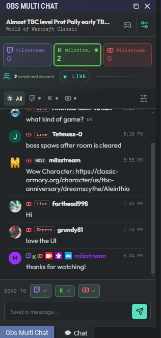

# Relay Chat Dock

A responsive OBS Browser Source that combines Twitch, Kick, and YouTube live chat into one dock. It starts offline and empty, then shows live accounts, viewer totals, messages, emotes, and a multi-platform composer after the companion backend connects.



## Download

The latest Windows build is on the [Releases](https://github.com/Milzstream/OBS-Multi-Chat/releases) page.

1. Download `obs-multi-chat-v*-windows-x64.zip`
2. Unzip it and fill in `production.env` with your API credentials
3. Run `relay-chat-dock.exe`
4. In OBS, add a Browser Source or custom dock pointed at `http://localhost:4173`

GitHub Actions builds that zip and attaches it to the GitHub Release when `main` first ships a given `package.json` version, when you push a `v*` tag, or when you run **Build and Release** from the Actions tab.

## What is included

- Responsive OBS dock with platform filters and compact mode
- OAuth callback server for Twitch, Kick, and YouTube
- Server-side token persistence in the local `data/tokens.json` file
- Twitch live detection, viewer count, IRC chat reading, message sending, and title/category updates
- YouTube live detection, viewer count, and live-chat polling
- Kick chat reading over Kick's public chat WebSocket (with a local browser lookup only if the chatroom id cannot be resolved from the channel API)
- SSE updates from the backend to the browser source
- Unified Twitch + Kick stream title/category controls
- Windows background executable packaging

## API setup

You need to create an API application for each platform. Use this callback URL in every provider dashboard:

```text
http://localhost:4173/oauth/callback
```

### Twitch

1. Visit https://dev.twitch.tv/console/apps.
2. Create a new application.
3. Set the OAuth redirect URL to the callback URL above.
4. Set the client type to **Confidential/Private**, copy the client ID, and generate a client secret.

The app requests email, IRC chat, EventSub chat read/write, and broadcast metadata permissions. After updating the app, disconnect and reconnect Twitch so the new chat scopes can be granted. The client secret stays in the backend environment file and is never sent to OBS.

### Google / YouTube

1. Visit https://console.cloud.google.com/.
2. Create or select a Google Cloud project.
3. Enable **YouTube Data API v3**.
4. Configure the OAuth consent screen.
5. Create an OAuth client as a **Web application**.
6. Add the callback URL above as an authorized redirect URI.
7. Copy the client ID and client secret.

The app requests YouTube read access and YouTube live metadata/chat access.

### Kick

1. Create an application in the Kick developer portal: https://dev.kick.com/.
2. Set the OAuth redirect URL to the callback URL above.
3. Copy the client ID and client secret.
4. Confirm that your account has access to the current Kick chat and channel API endpoints. The app requests `channel:write` so it can update stream metadata.

Kick API access can vary by developer account and API version, so the backend accepts `KICK_API_BASE` for the current public API base URL. It defaults to `https://api.kick.com/public/v1`. Incoming Kick chat uses Kick's public Pusher WebSocket; sending still uses the official chat API.

## Configure the backend

Create the environment file from the included template. For the packaged Windows executable, name it `production.env` and place it beside the `.exe`:

```powershell
copy .env.example production.env
notepad production.env
```

Fill in the values:

```env
PORT=4173
OAUTH_REDIRECT_URI=http://localhost:4173/oauth/callback

TWITCH_CLIENT_ID=your_twitch_client_id
TWITCH_CLIENT_SECRET=your_twitch_client_secret

KICK_CLIENT_ID=your_kick_client_id
KICK_CLIENT_SECRET=your_kick_client_secret
KICK_API_BASE=
# Optional if Edge/Chrome is installed in a non-standard location:
# KICK_BROWSER_PATH=C:\\Path\\To\\msedge.exe

YOUTUBE_CLIENT_ID=your_google_client_id
YOUTUBE_CLIENT_SECRET=your_google_client_secret
```

Never commit or share `.env`. Client secrets, access tokens, and refresh tokens must remain on the backend and must not be placed in `VITE_` variables or the OBS Browser Source.

## Run with Node

```powershell
npm install
npm run build
npm start
```

The backend serves the completed dock at:

```text
http://localhost:4173
```

Add that URL to OBS as a **Browser Source**. Keep `npm start` running while OBS is open. For frontend development, use `npm run dev` and run `npm run dev:backend` in a second terminal.

Click **Connect** for each platform in the dock. Each button opens a browser authorization window. After authorization, the callback stores the token and the backend begins polling or connecting to the platform.

## Run as a Windows background app

Prefer the [prebuilt Windows zip](https://github.com/Milzstream/OBS-Multi-Chat/releases) unless you are changing the code. To build the executable locally:

```powershell
npm run package:win
```

This creates `relay-chat-dock.exe` using the Node 18 Windows x64 runtime supported by the packaging tool. Keep `production.env` beside the executable, then run:

```powershell
.\relay-chat-dock.exe
```

The same command also creates a ready-to-copy `deploy` folder containing the latest executable, frontend `dist` files, and `production.env`. Copy that entire folder to the installation computer and run `deploy\relay-chat-dock.exe`. When a root `production.env` exists, it is copied into `deploy` on each build, so edit the root file before packaging.

The executable serves the dock at `http://localhost:4173`. Start it before opening OBS.

## Backend endpoints

- `GET /api/state` - current accounts, stream info, and recent messages
- `GET /events` - Server-Sent Events stream for dock updates
- `POST /api/messages` - send a message to selected platforms
- `GET /api/categories/:platform` - search Twitch or Kick categories
- `POST /api/stream-info/:platform` - apply title/category to one platform
- `POST /api/disconnect/:platform` - remove a saved platform connection
- `GET /oauth/:platform` - begin OAuth for `twitch`, `kick`, or `youtube`
- `GET /oauth/callback` - exchange the provider authorization code server-side

## Current platform status

Twitch reads chat through EventSub WebSockets and sends through the Helix chat API, with Twitch IRC as a fallback for older tokens. YouTube OAuth, live detection, viewer counts, and chat polling are implemented. Kick OAuth, category search, chat sending, viewer polling, and metadata updates use the current public API. Incoming Kick chat is read from Kick's public chat WebSocket after resolving the channel's chatroom id.
